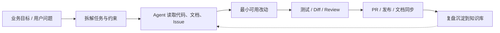

# Hi，我是 tangly1024

**全栈工程师 · 开源作者 · AI Agent 工程实践者**

电气工程自动化出身，自学转入软件开发多年。  
我长期关注 **Web 全栈、系统架构、Notion 生态、AI Agent 工作流**，喜欢把真实项目里的复杂需求拆成可交付、可维护、可复盘的工程结果。

  
  
  
  

  
  

---

## 我正在做什么

我在把 AI Agent 从「聊天工具」推进到「工程协作者」：让它参与需求拆解、代码改造、文档维护、问题复盘、发布检查和社区支持，并在人类把关下形成稳定闭环。

| 方向 | 现在的重点 |
| --- | --- |
| **AI Agent 工程化** | Codex / Claude Code / Cursor 协同，覆盖代码阅读、实现、测试、Review、GitHub 维护 |
| **MCP 与工具链** | 浏览器、GitHub、Notion、文档、部署工具联动，让 Agent 直接接触真实上下文 |
| **知识库与 RAG** | 将项目文档、Issue、FAQ、设计规范沉淀成可检索的工程记忆 |
| **开源产品** | 维护 [NotionNext](https://github.com/tangly1024/NotionNext)，持续改进主题、文档、生态与社区治理 |
| **商业决策 Agent** | 在研 AI 多因子商业决策大脑，用模型辅助项目选择、成本测算和运营策略 |

---

## 我的 AI Agent 工作方式

> 不把 AI 当万能替代品，而是把它放进真实工程流程里：人定方向，Agent 执行，结果必须能验证。

| 场景 | 我怎么用 Agent |
| --- | --- |
| **代码实现** | 先读真实调用链，再做最小改动；让 Agent 处理重复劳动，人负责边界和取舍 |
| **代码审查** | 用多模型交叉看 bug、兼容性、测试缺口和过度设计 |
| **开源维护** | Issue 分流、PR 分析、CI 失败定位、版本说明和用户回复都进入工作流 |
| **文档生产** | 将散落经验整理成 README、教程、FAQ、维护手册和发布清单 |
| **产品探索** | 快速做原型、验证路径、估算成本，再决定是否继续投入 |

---

## 代表项目

| 项目 | 简介 | 链接 |
| --- | --- | --- |
| **NotionNext** | Notion 驱动的静态博客系统，支持多主题、文档站、预览站和社区扩展 | [GitHub](https://github.com/tangly1024/NotionNext) · [文档](https://notionnext.tangly1024.com) · [预览](https://preview.tangly1024.com) |
| **AI 多因子商业决策大脑** | 面向创业者和项目团队的决策辅助系统，聚焦项目判断、财务成本和运营活动 | 在研中 |
| **tangly1024.com** | 我的个人站点、作品入口和主题体验入口 | [访问](https://tangly1024.com) |

---

## 技术栈

| 领域 | 常用技术 |
| --- | --- |
| **前端 / 全栈** | Next.js、React、Vue、UniApp、TailwindCSS、Bootstrap |
| **后端** | Java、Spring Boot、Spring Cloud、Node.js、Python、Flask、PHP |
| **数据与中间件** | MySQL、Redis、Oracle、RabbitMQ、MyBatis、Hibernate |
| **工程与部署** | Docker、Kubernetes、Rancher、Vercel、GitHub Actions、CI/CD |
| **AI 工程** | Codex、Claude Code、Cursor、MCP、RAG、Embedding、Prompt Engineering、Multi-Agent |
| **跨界经验** | STM32、STEP7、Altium Designer、Final Cut Pro |

  <a href="https://skillicons.dev">
    <picture>
      <source media="(prefers-color-scheme: dark)" srcset="https://skillicons.dev/icons?i=js%2Cts%2Creact%2Cnextjs%2Cvue%2Cjava%2Cspring%2Cdocker%2Ckubernetes%2Cpython%2Credis%2Cmysql%2Cnotion%2Cgit%2Cgithub%2Cvercel&amp;theme=dark&amp;perline=8" />
      <source media="(prefers-color-scheme: light)" srcset="https://skillicons.dev/icons?i=js%2Cts%2Creact%2Cnextjs%2Cvue%2Cjava%2Cspring%2Cdocker%2Ckubernetes%2Cpython%2Credis%2Cmysql%2Cnotion%2Cgit%2Cgithub%2Cvercel&amp;theme=light&amp;perline=8" />
      
    </picture>
  </a>

---

## 可以找我聊

- NotionNext 使用、主题适配、部署与二次开发
- AI Agent 落地到真实研发流程
- 旧系统重构、全栈交付、工程效率改进
- 开源协作、文档建设、Issue / PR 工作流

欢迎通过 [GitHub Discussions](https://github.com/tangly1024/NotionNext/discussions) 或 [Issues](https://github.com/tangly1024/NotionNext/issues) 交流。

**用代码连接 Notion 与创作者，用 AI 放大工程效率。**

Profile README · 持续更新中

